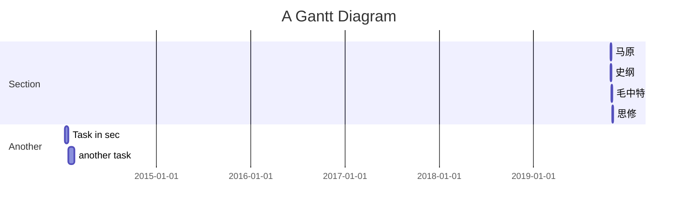

## plan

|  2019.10.19   | 内容 | 完成情况 | 完善之处 |
| ----  | ----  | ----  | ----  | 
| 线性方程组 强化+基础 |  |  |  | 
| https://www.youtube.com/watch?v=rxNDD_Sp9hE | 强化25:辅导讲义93-98 | 完成 | |
| https://www.youtube.com/watch?v=nZ-A6bhMrzs | 强化26:辅导讲义100题型一例2,3，题型二结构与性质例1，2，3，4 | 完成 | |
| https://www.youtube.com/watch?v=qa1uraprnlI | 强化27:辅导讲义100题型二结构与性质 | 完成 | |
| https://www.youtube.com/watch?v=NlT5ZWhz6qk | 强化28:辅导讲义含参方程组解的讨论 P105例3 | 未完成 | |
| https://www.youtube.com/watch?v=WRqBjMmMJso | 基础24:定理+齐次方程组通解 | 完成 | |
| 2019.10.19 | 内容 | 完成情况 | 完善之处 |
| 线性方程组 强化+基础 |  |  |  | 
| https://www.youtube.com/watch?v=Zfer-gKAraI | 基础25 | | |  
| https://www.youtube.com/watch?v=kFW0IcTp7mM | 基础26 | | |  
| https://www.youtube.com/watch?v=osJBE9cmdsw | 基础27 | | |  
| https://www.youtube.com/watch?v=dLoWqkNC-ms | 基础28 | | |  
| 接力题典66-69，130-133 线性方程组题目 | 完成否？ |  | |  
| 概率论 随机事件与概率 强化+基础 | 完成否？ |  | |  
| 接力题典76-78，139-141 随机事件与概率题目 | 完成否？ | | |  
| 高数 函数极限连续 强化+基础| 完成否？ | | |  
| 接力题典3-11，93-96 函数极限连续题目 | 完成否？ |  | |  
| 接力题典69-72，133-137 线性方程组题目 | 完成否？ | | |  
| 随机变量及其分布 强化+基础| 完成否？ |  | |  
| 接力题典78-80，141-142 随机事件与概率题目  | 完成否？ |  | |  
| 导数与微分 强化+基础 | 完成否？ |  | |  
| 接力题典 11-16，97-105  | 完成否？|  | |  

>数学   
>>线性代数    
>>>基础课https://www.youtube.com/playlist?list=PLRMOX8QaZK8wjE39xZRL202PHZb_y2nza  
>>>强化课https://www.youtube.com/playlist?list=PLRMOX8QaZK8wQWSNuwwbC37J_SXJMxvwx  
>>>汤家凤线性代数辅导讲义  

>>概率论   
>>>基础课https://www.youtube.com/playlist?list=PLRMOX8QaZK8w8v4P7lvAIXTXuRGBSKQLo  

>>高等数学        
>>>基础课https://www.youtube.com/playlist?list=PLRMOX8QaZK8zqRXVxtqoXia0zy5diEiNO  
>>>强化课https://www.youtube.com/playlist?list=PLRMOX8QaZK8zknameSu93zhpMS7nT09Gd  
>>>汤家凤高等数学辅导讲义   

>>冲刺  
>>>汤家凤真题https://www.youtube.com/playlist?list=PLRMOX8QaZK8ww_jckQhwbSJfFFr1Le01A  
>>>接力题典1800 https://www.youtube.com/playlist?list=PLRMOX8QaZK8waAtPajFzL43B-fan8huQk  

>>模拟题   
>>>合工大  
>>>汤家凤国庆8套卷  
---
>英语  
>>作文-考研英语作文36法则  
>>阅读-  
>>单词-朱伟恋练有词  
>>语法-语法卡  
---
>专业  
>>计算机网络  
---
| 内容 | 一刷 | 二刷 |
| ---- | ---- | ---- |
|  | | |
 
---

>计算机
>>计算机网络 https://www.youtube.com/playlist?list=PLg5ULjirtivsrP-CITWxG0ZnhXrCBuEJv   
>>计算机网络习题 https://www.youtube.com/playlist?list=PL0MagCinIFowj8eGl_IPnA-yHQJe6Boyc   
>>操作系统  https://www.youtube.com/playlist?list=PLg5ULjirtivtd1p89jL5t1SKU6batBysz   
>>数据结构  https://www.youtube.com/playlist?list=PLg5ULjirtivvCYIB3wRZigJC8E9oc8w_B   
>>计算机组成 https://www.youtube.com/playlist?list=PLg5ULjirtivtsUL_W7Mdbc3cjk-E_kdQx   

>政治  
>>政治选择题 https://www.youtube.com/playlist?list=PLRMOX8QaZK8xkPDj93KnIQWsO4xRfL0h9  ✔ 
---
>>马克思原理     
>>>强化 https://www.youtube.com/playlist?list=PLRMOX8QaZK8wyXLGWjui4yxkasZlY1wn9  ✔

---

|内容 | 一刷| 二刷 |  
| ----  | ----  | ---- |  
| 1.导论与哲学基本内容1 |√| |  
| 2.导论与哲学基本内容2 |√ | |  
| 3.唯物论物质观 |√ | |  
| 4.唯物论与意识观1 | √| |  
| 5.唯物论与意识观2 |√ | |  
| 6.辩证法的两大总特征 |√ | |    
| 7.辩证法五对范畴1 |√ | | 
| 8.辩证法五对范畴2 | 现象与本质√现实与可能√内容与形式√| |
| 9.对立统一规律1 | | | 
| 10.对立统一规律2 | | | 
| 11.质量互变定律 | | |  
| 12.否定之否定定律 | | |  
| 13.认识论实践与认识 | | |  
| 14.认识的本质过程和规律1 | | |  
| 15.认识的本质过程和规律2 | | |  
| 16.真理与谬误1 | | | 
| 17.真理与谬误2 | | | 
| 18.社会基本矛盾1 | | |  
| 19.社会基本矛盾2 | | |  
| 20.社会形态更替与历史创造者1| | |  
| 21.社会形态更替与历史创造者2 | | |  
| 22.商品的两因素与生产商品劳动的二重性 | | |  
| 23.价值规律与简单商品经济的基本矛盾1 | | |   
| 24.价值规律与简单商品经济的基本矛盾2 | | |  
| 25.剩余价值的生产与积累1 | | |  
| 26.剩余价值的生产与积累2 | | |  
| 27.剩余价值的流转与分配1 | | |  
| 28.剩余价值的流转与分配2 | | |  
| 29.垄断资本主义发展1 | | |  
| 30.垄断资本主义发展2 | | |  
| 31.社会主义社会与共产主义社会  | | |  

--- 
>>毛概1.分值高占30 与史纲交叉考查的有40 2.记忆性强 3.时效性强 40分里有20%-30%来自于新闻 
>>>强化 https://www.youtube.com/playlist?list=PLRMOX8QaZK8xMMmj6NpoCr58dVA8qU6bc    ✔
>>> 第1位.第10-11 新时代中国特色社会主义的布局  第2位.8新时代的新思想和历史地位，9总任务，5邓小平理论  第3位.6，7，12，13，14 
>>>冲刺班
>>>押题班
---
>>思修   
>>>强化 https://www.youtube.com/playlist?list=PLRMOX8QaZK8yECo8L2BuGUOgMq_s_7zA7   ✔
---
>>中国近代史纲要   
>>>youtube-dl https://www.youtube.com/playlist?list=PLRMOX8QaZK8wMeWFEntKNCn7lE_WEW7FQ -f 18 --playlist-start 1 --playlist-end 21 -o '%(title)s.%(etc)s' 
>>>强化 https://www.youtube.com/playlist?list=PLRMOX8QaZK8wMeWFEntKNCn7lE_WEW7FQ   
---

